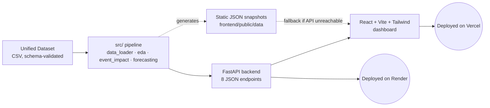

# Ethiopia Financial Inclusion Forecast

**Forecasting Ethiopia's digital financial transformation — built for a
consortium of development finance institutions, mobile money operators, and
the National Bank of Ethiopia.**

[](https://ethiopia-financial-forecast.vercel.app/)
[](https://ethiopia-financial-forecast.onrender.com/docs)
[](./tests)
[](./frontend)
[](./backend)

**[→ Live Dashboard](https://ethiopia-financial-forecast.vercel.app/)** · **[→ API Docs (Swagger)](https://ethiopia-financial-forecast.onrender.com/docs)**

> The API is on Render's free tier and sleeps after 15 minutes idle — the
> first load after inactivity can take 30-50s to wake up. The dashboard
> itself never breaks while this happens: it automatically falls back to
> bundled data snapshots, so every page still renders instantly either way.

---

## The problem

Ethiopia's digital financial system grew explosively — Telebirr passed 54
million users, M-Pesa entered the market in 2023, and P2P digital transfers
recently overtook ATM cash withdrawals for the first time. Yet Global Findex
data shows account ownership grew only **+3 percentage points** between 2021
and 2024, a sharp deceleration from the +11pp and +13pp gains of prior
rounds. The consortium needed to know: what's actually driving inclusion,
and where is it headed through 2027?

## What this project delivers

An end-to-end forecasting system — not just charts, a full pipeline with a
validated model behind it:

- **Enriched dataset**: the starter data had zero `impact_link` records
  connecting events to outcomes and no observation for the Usage/digital
  payment forecast target. Both gaps were identified, sourced, and closed —
  documented line-by-line in [`data_enrichment_log.md`](./data_enrichment_log.md).
- **A validated causal model, not just a fitted curve**: the event-impact
  model's estimate for Telebirr + M-Pesa's effect on mobile money adoption
  (9.14%) lands **0.31 percentage points** from the actual observed 2024
  figure (9.45%) — checked against real data, not asserted.
- **Honest forecasting**: base-case Access is projected at **54.6% for
  2025**, a **15.4pp shortfall** against the NFIS-II policy target of 70%.
  Where the model rests on unvalidated, forward-looking assumptions (events
  that launched in 2024-2025 with no post-period data yet), that's flagged
  explicitly rather than hidden behind a confident-looking number.
- **A real product, not a notebook**: FastAPI backend, React dashboard with
  a custom design system, deployed and live at the links above.

## Key findings

| Question | Finding |
|---|---|
| Why did Access grow only +3pp despite 65M+ mobile money accounts opened? | Ethiopia has almost no mobile-money-only users (~0.5%) — most new registrants were already banked, so registration growth doesn't convert 1:1 into new Findex "account owners." |
| Does the model's estimate match reality? | Yes — validated against the one clear historical test case (Telebirr + M-Pesa's mobile money effect): **0.31pp off** the observed figure. |
| Where's Ethiopia headed by 2027? | Base case: still **~15pp short** of the NFIS-II 70% Access target. The largest-impact levers (Fayda digital ID, M-Pesa/EthSwitch interoperability, EthioPay) are all too recent to have validating data yet — genuine uncertainty, not model weakness. |
| What closed the gender gap? | Almost nothing — 20pp (2021) → 18pp (2024). Mobile money expansion hasn't meaningfully reached Ethiopia's gender inclusion divide. |

## Architecture



The frontend never hard-depends on the backend being awake — it tries the
live API first and transparently falls back to static snapshots generated
by the same pipeline. That's a deliberate reliability choice for a
free-tier deployment, not an accident.

## Tech stack

| Layer | Choice | Why |
|---|---|---|
| Data & modeling | Python, pandas, numpy | Schema-validated ETL, logistic-ramp event-effect model, OLS trend + scenario forecasting |
| API | FastAPI, uvicorn | Typed, auto-documented (`/docs`), thin wrapper over a tested `src/` pipeline — no logic duplicated between notebook and API |
| Frontend | React, Vite, Tailwind v4, Recharts | Custom design system (not defaults) — navy/gold/teal "financial terminal" register suited to a DFI/central-bank audience |
| Testing | pytest, GitHub Actions CI | 10 tests covering schema validation, model tolerance, forecast sanity (CI ordering, scenario monotonicity) |
| Deployment | Render (API) + Vercel (frontend) | `render.yaml` Blueprint for reproducible backend deploys; static-fallback frontend for zero-cold-start demo reliability |

## What this project demonstrates

- **Data engineering under real gaps**: identifying missing data (not just
  cleaning what's given), sourcing it defensibly, and documenting every
  addition with confidence levels and evidence basis.
- **Modeling discipline**: catching and fixing a real double-counting bug
  during development (event effects being counted both in the historical
  trend *and* added again), then validating the corrected model against
  held-out reality rather than trusting the math on faith.
- **Full-stack ownership**: same person who built the forecasting model
  built the API contract and the production UI consuming it — no hand-off
  gaps, no mismatched assumptions between layers.
- **Production judgment**: caught a missing dependency that would have
  silently broken the live deploy (`matplotlib` imported at module level in
  a file the API depends on, but never installed on the backend) — fixed by
  making the import lazy rather than papering over it with an unnecessary
  dependency.

## Quickstart (local development)

```bash
git clone https://github.com/melat33/Ethiopia-Financial-Forecast
cd Ethiopia-Financial-Forecast
pip install -r requirements.txt

# Run the analytical pipeline
python src/data_loader.py
python src/eda.py
python src/event_impact.py
python src/forecasting.py
pytest tests/ -v

# Run the dashboard locally
cd backend && pip install -r requirements.txt && uvicorn main:app --reload --port 8000
cd frontend && npm install && npm run dev   # http://localhost:5173
```

Full deployment instructions (Render + Vercel, one-click Blueprint, CORS
hardening) are in [`DEPLOYMENT.md`](./DEPLOYMENT.md).

## Project structure
├── data/               # raw (source) + processed (generated) datasets
├── src/                # data_loader, eda, event_impact, forecasting
├── backend/             # FastAPI — wraps src/ as JSON endpoints
├── frontend/            # React + Vite + Tailwind dashboard
├── notebooks/           # executed walkthroughs, one per task
├── tests/                # 10 tests, run in CI on every push
├── reports/              # methodology, limitations, generated figures
└── data_enrichment_log.md
## Methodology, assumptions, and limitations

Every event-impact estimate is tagged with its evidence basis (`empirical`,
`literature`, `theoretical`, or `expert` judgment) and every number is
traceable to either an observed data delta or a named comparable-market
precedent — see [`reports/impact_links_methodology.md`](./reports/impact_links_methodology.md)
for the full breakdown, including what's confidently known versus what's a
scenario assumption still waiting on 2025-2027 data to validate.

---

Built by **Melat** — AI/ML engineering, 